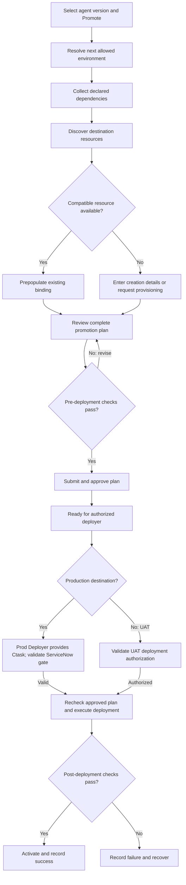

# Guardian Control Plane — Environment Promotion Flow Proposal

**Status:** Draft for design discussion  
**Date:** 10 September 2026  
**Scope:** Organization environment configuration, agent dependency resolution, deployment authorization, ServiceNow Ctask integration, and audit history.

## 1. Purpose and proposed outcome

We propose extending the Guardian Control Plane so an organization can associate separate AWS accounts with Dev, optional UAT, and Production environments. Users would prepare an agent promotion by reviewing its destination dependencies, reusing compatible resources, and supplying configuration for missing resources. An approved plan would then be executed by an authorized deployer.

Production execution would require the **Prod Deployer** role and a validated ServiceNow **Ctask**. The Control Plane would retain the Ctask-to-deployment relationship and historical evidence for business review and audit.

This document describes a proposed flow, not a verified implementation or final architecture decision. The team should confirm integration contracts, ownership, and approval rules before implementation.

## 2. Current starting point and proposed extension

Today, organization setup supports connecting one AWS account. The proposed extension adds up to two additional environment accounts while preserving the existing organization and project structure.

| Area | Proposed behavior |
| --- | --- |
| Organization | Owns the environment mappings and promotion policy. |
| Environment | Maps a stable environment ID and type to an AWS account, supported Region, and role references. |
| Project | Retains agent ownership and scoped access to approved tools. |
| Agent version | Defines the exact release artifact and declared dependencies being promoted. |
| Promotion plan | Records destination mappings, planned resource creation, validation, and approval. |
| Deployment attempt | Records execution, Ctask linkage for production, results, and recovery evidence. |

Existing organization-to-account references would need a backward-compatible migration to environment mappings. Confirm the existing account's environment classification before migration rather than silently relabeling production accounts as Dev.

## 3. Organization environment setup

An organization administrator would configure the following:

| Field | Purpose |
| --- | --- |
| Environment type | Dev, UAT, or Production; controls policy independently of display labels. |
| AWS account ID and Region | Identifies the destination for discovery and deployment. |
| Discovery role | Read-only discovery of approved resource types within the environment. |
| Deployment role | Scoped provisioning and deployment permissions. |
| Execution role references | Approved runtime/harness and Gateway roles passed to their services. |
| Promotion policy | Allowed transitions, approval requirements, and deployer roles. |
| Readiness | Account connectivity, role trust, and required service readiness. |

The initial supported routes would be:

| Configured environments | Allowed standard route |
| --- | --- |
| Dev and Production | Dev → Production |
| Dev, UAT, and Production | Dev → UAT → Production |

The UI would show only the next eligible destination. With UAT configured, production promotion would start from the version successfully deployed and validated in UAT. The same artifact digest would be carried forward; environment configuration would be resolved separately.

Promotion policy should be explicit and versioned. Changing an environment label must not weaken production controls. Changes to account mappings or promotion policy would require affected pending plans to be reviewed again. Emergency bypass rules remain a design decision and are outside the initial standard flow.

## 4. Proposed end-to-end flow

The diagram summarizes preparation and execution. Failed role or Ctask validation keeps the plan blocked; production mutation does not begin. Dependency checks apply to every required dependency, and all rows must be resolved before submission.

### 4.1 Start promotion

The user selects an eligible agent version and chooses Promote. The Control Plane resolves the next environment from the organization's promotion policy and creates a draft promotion plan.

The plan captures source deployment, artifact digest, destination account and Region, and policy version. Promotion can be saved as a draft and resumed without provisioning production resources.

### 4.2 Collect dependencies and discover destination resources

The Control Plane reads the agent version's declared dependency manifest, then checks the destination catalog and AWS resources using the destination Discovery role. Dependencies can include Gateway tools, credential-provider references, agent grants, model configuration, knowledge bases, memory configuration, execution roles, and network requirements.

AWS discovery supports verification and candidate matching; it cannot reliably infer all dependencies hidden in agent code. Dynamically selected tools and external dependencies must therefore be declared or explicitly reviewed.

Match by logical resource identity and compatible contract version. Names and tags may suggest candidates but are insufficient as the sole matching criteria. If several candidates match, require an explicit selection.

### 4.3 Review, reuse, or configure missing resources

Present one dependency review table showing the source requirement, destination match, planned action, readiness, and owner. Users can confirm prepopulated bindings or select an approved alternative. Authorized users can enter configuration for resources that must be created.

| Example dependency | Destination finding | Preparation action | Execution action |
| --- | --- | --- | --- |
| Tool A | Compatible production target exists | Confirm its binding and approved operations | Reuse target |
| Tool B | Target missing | Supply target schema, endpoint, and authentication references | Create target |
| Tool B backend API | Production API exists | Confirm API contract and connectivity | Reference API |
| Tool B credential provider | Provider missing | Supply approved production credential configuration through the secure process | Create provider and bind target |
| Agent-to-tool grant | Production grant missing | Obtain required authorization | Apply approved grant |

Suggested row states: **Mapped**, **Planned creation**, **Awaiting provisioning**, and **Blocked**.

Creating a Gateway target does not create its backend business API. If an external API or network prerequisite is missing, route it to its owner and keep the dependency blocked until it is ready. Provide a refresh action after external provisioning completes.

Existing shared targets should be reused without silent changes to their schema, credentials, or permissions. A requested shared-target change should be handled as a separately reviewed change with impact assessment.

### 4.4 Validate and approve the plan

Pre-deployment validation would check:

- Destination account and Region, role access, and allowed promotion transition.
- Required dependency coverage and tool contract compatibility.
- Production endpoint and credential references, required scopes, and permissions.
- Agent and project grants, runtime configuration, and declared networking prerequisites.
- Existing-resource readiness and configuration completeness for planned creations.

A planned resource can pass configuration validation before it exists; operational validation must follow creation. The UI must distinguish these two levels of readiness.

The user submits the reviewed plan. The applicable approver accepts it according to organization policy. User confirmation and formal approval should be recorded separately if the roles differ. The approved plan is frozen with a version or digest; material edits require revalidation and renewed approval.

Preparation records intended changes. Production resource creation begins only after execution gates, unless a dependency was independently provisioned under an approved process.

## 5. Deployment authorization and ServiceNow Ctask integration

### 5.1 Production deployment action

An approved, ready plan enables the production deployment action for users with the **Prod Deployer** role scoped to the relevant organization, project, and environment. Other users can view the plan according to their access rights.

The backend must enforce these conditions independently of the UI. The Control Plane assumes the destination Deployment role for execution and passes the approved execution roles to the AWS services. Application roles and AWS IAM permissions are separate controls.

### 5.2 Ctask selection and validation

When a Prod Deployer selects Deploy to Production, the UI asks for the ServiceNow Ctask. The backend looks up the record through the existing ServiceNow integration and presents the relevant details before final submission.

Proposed validation rules, subject to Guardian's ServiceNow workflow:

| Check | Proposed purpose |
| --- | --- |
| Ctask exists | Reject unknown or inaccessible records. |
| Application/service association | Confirm that the task covers the intended deployment scope. |
| Eligible task state | Confirm implementation is permitted. |
| Parent change approval, where applicable | Confirm the governing change is approved. |
| Approved implementation window, where applicable | Permit execution only in the authorized window. |

The exact ServiceNow table, fields, state values, relationship to a parent change, and read permissions need confirmation. The proposal does not assume that all these controls reside directly on the Ctask record.

Record the Ctask display number, immutable sys_id, URL, relevant parent reference, validation timestamp, and a minimal snapshot of the authorization evidence. Revalidate immediately before production changes begin. If validation fails or ServiceNow is unavailable, the proposed default is to keep execution blocked and allow a retry.

Updating Ctask work notes or closing tasks automatically is a separate integration decision; the initial scope is lookup, validation, and audit linkage.

## 6. Execution and recovery

The deployment worker would run asynchronously with persisted progress and a correlation ID. It would:

1. Recheck caller authorization, plan approval, allowed transition, Ctask eligibility, and material resource drift.
2. Acquire a lock for the agent and destination to prevent conflicting deployments.
3. Create approved missing dependencies in dependency order using retry-safe requests.
4. Deploy the pinned agent artifact and resolve its destination Gateway, tool, knowledge-base, and other bindings.
5. Apply approved grants and perform operational validation.
6. Activate the new deployment after successful checks and record the outcome.

Validation should include representative authorized tool calls, an unauthorized-call denial, outbound authentication, and backend connectivity. Tests that could change business data require an agreed safe test approach.

Failure handling should preserve the prior working deployment where supported and record which resources were created, reused, or left incomplete. Rollback should restore prior agent configuration and bindings; it must not delete reused resources or reverse shared changes indiscriminately. Recovery after activation and cleanup ownership need explicit design.

## 7. Audit and business visibility

Provide a **Production Deployment History** view showing all retained production attempts and their Ctasks, including failed and rolled-back attempts. Authorized business users and auditors should be able to filter by Ctask, agent, project, environment, date, deployer, and status, then open the deployment evidence.

| Evidence | Proposed recorded information |
| --- | --- |
| Release | Agent/version, artifact digest, source and destination |
| Plan | Immutable approved plan version and resource mappings |
| Accountability | Requester, reviewer/approver, deployer, timestamps |
| Ctask | Number, sys_id, link, parent reference, validation snapshot |
| Changes | Reused resources, newly created resources, approved grants |
| Execution | Attempt ID, step progress, validation results, failure/recovery details |

Model the Ctask-to-deployment relationship to allow multiple attempts or releases under one Ctask if Guardian policy permits it. Do not overwrite an earlier attempt when a retry occurs. Use append-only audit events with controlled retention and access; store references and minimal evidence, never secrets or access tokens.

## 8. Proposed integration responsibilities

| Component | Proposed responsibility |
| --- | --- |
| Control Plane UI | Environment setup, promotion wizard, dependency review, deployment action, history |
| Control Plane API | Authorization, route resolution, plan lifecycle, approvals, validation, audit |
| Dependency resolver | Manifest expansion, logical-to-environment mapping, compatibility checks |
| AWS discovery adapter | Read destination inventory and resource configuration |
| Deployment worker | Assume destination role, execute planned changes, persist status and recovery |
| ServiceNow adapter | Resolve Ctask and evaluate agreed execution eligibility rules |
| Control Plane database | Environment mappings, plans, approvals, attempts, Ctask links, audit events |

Suggested conceptual records are OrganizationEnvironment, PromotionPolicy, ResourceEnvironmentBinding, PromotionPlan, PromotionDependency, Approval, DeploymentAttempt, CtaskReference, and AuditEvent. These are design concepts to reconcile with existing entities, not prescribed table names.

## 9. Feasibility and boundaries

The AWS portion is feasible through service APIs and account-scoped roles. AgentCore exposes Gateway target discovery and creation APIs, including target configuration and outbound credential-provider configuration. Guardian-specific promotion routing, dependency mapping, approval, and audit behavior would be implemented in the Control Plane.

The primary implementation risks are completeness of declared dependencies, compatibility of shared tools, secure production credential provisioning, and recovery from partial deployment. A broad AWS account scan alone will not solve these concerns.

We propose an initial supported-resource list. Resources outside that list would use an external-provisioning action with ownership and readiness evidence, rather than an unrestricted promise to clone every AWS resource.

## 10. Decisions requested from the design team

| Topic | Proposed starting position | Discussion needed |
| --- | --- | --- |
| Environment model | Dev, optional UAT, Production; one account per configured environment | Account uniqueness and Region support |
| Promotion routing | Follow configured sequence; no standard UAT bypass | Emergency process, if required |
| Approval ownership | Organization policy; retain platform governance approval requirements | Who prepares, approves, and deploys; separation of duties |
| Resource creation | Plan during preparation; execute after deployment gates | Initial supported resource types and owners |
| Shared resources | Reuse compatible approved bindings without silent mutation | Contract versioning and change ownership |
| Ctask gate | Validate before production mutation | Table/fields, eligible states, windows, scope matching, reuse rules |
| Credential provisioning | Secure references and environment-specific providers | Who supplies credentials and how readiness is verified |
| Recovery | Preserve prior deployment and track partial changes | Activation strategy and cleanup ownership |
| Audit | Historical attempts with Ctask linkage and immutable evidence | Retention, viewer roles, reporting/export needs |

## 11. Suggested delivery sequence

1. Add environment account mappings and explicit promotion routes.
2. Add declared dependencies, destination discovery, and the review wizard.
3. Add versioned plan approval and scoped deployer authorization.
4. Integrate Ctask validation and controlled production execution.
5. Add recovery handling and the consolidated deployment history view.

An initial demonstration should cover both Dev → Production and Dev → UAT → Production, an agent with one reused tool and one newly created tool, invalid Ctask rejection, unauthorized production deployment rejection, and a failed deployment recorded in history.

## 12. Diagram files and Confluence use

- **Guardian_Promotion_Flow.drawio:** Editable diagrams.net XML with native shapes and connectors. Open or import it with diagrams.net or the available Confluence Draw.io integration.
- **Guardian_Promotion_Flow.mmd:** Standalone Mermaid source matching the flow embedded in this document.

Markdown and Mermaid rendering depend on the import/editor capabilities enabled in your Confluence instance. If Mermaid is not rendered, use the source in an enabled Mermaid macro or embed the Draw.io diagram.

## References

These references support the integration surfaces; organization policy and workflow details above remain proposed Guardian design decisions.

- [AWS AgentCore ListGatewayTargets](https://docs.aws.amazon.com/bedrock-agentcore-control/latest/APIReference/API_ListGatewayTargets.html)
- [AWS AgentCore CreateGatewayTarget](https://docs.aws.amazon.com/bedrock-agentcore-control/latest/APIReference/API_CreateGatewayTarget.html)
- [AWS AgentCore outbound authorization](https://docs.aws.amazon.com/bedrock-agentcore/latest/devguide/gateway-outbound-auth.html)
- [ServiceNow Change Management API](https://www.servicenow.com/docs/r/zurich/api-reference/rest-apis/change-management-api.html)
